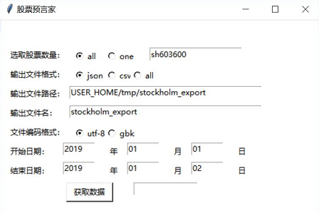
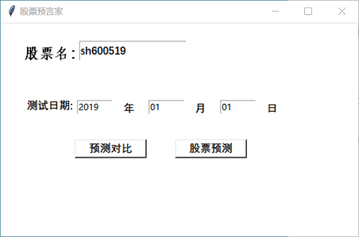

股票预言家
=======
### 一个股票数据爬虫、选股策略测试和股票预测软件，数据基于新浪财经、腾讯股票和搜狐股票。
#
基本功能
-------------
* 根据选定的日期范围抓取所有（或者指定的）沪深两市股票的行情数据。
* 通过爬取的数据计算得到一系列的股票指标。
* 把数据保存到JSON文件、CSV文件。
* 根据指定的选股策略和指定的日期（可以用户自定义）进行选股测试。
* 显示用户指定股票某天的详细数据。
* 对指定股票的数据作图显示。
* 使用深度学习——长短期记忆网络（LSTM），深度学习框架：Keras，tensorflow后端
* 神经网络层（调参）：Sequential，Dense，LSTM
* windows和linux系统均可使用<br>

安装环境
-------------
Python 3以上<br>
[Requests](http://www.python-requests.org/en/latest/)<br>
[PyMongo](http://api.mongodb.org/python/current/installation.html)<br>
[numpy](http://www.numpy.org/)<br>
[matplotlib](https://matplotlib.org/)<br>
[pandas](http://pandas.pydata.org/)<br>
[scikit-learn](https://scikit-learn.org/stable/)<br>

```shell
pip install requests
pip install pymongo
pip install numpy
pip install scipy
pip install -U scikit-learn 
python -m pip install matplotlib
```

改进方向
-------------
* 数据爬取的方式可以更多样。搜狐数据接口的数据获取速度比较慢，可以加以改进以提高数据获取速度。<br>
* 目前只获取股票的日线，可以增加获取时线和月线等。<br>
* 目前的股票预测功能只能预测一天后的收盘价，后续可以改进使之能预测数天后的收盘价。<br>
* 在股票预测中，只考虑了每日的收盘价，没有考虑成交量、换手率等数据，可以在后续分析中加入使得预测更为准确。<br>
* 选股策略方面，后续可考虑让用户更自由地选择更多参考标准。<br>

使用方法
-------------
### 1. 图形界面<br>
#### 主界面：可以选择股票数据、股票预测选项
<br>
#
#### 股票数据获取界面
可以选择获取单支或者全部股票的数据，存取到CSV或者JSON文件
<br>
#
#### 选股测试界面
可以自由修改选股策略文件，根据自身需求选股，执行完成后，数据保存在当前用户文件夹下./tmp/stockholm_export/<br>以用户所选日期到进行倒推n天得选股策略测试。<br>选股策略的测试文件<br>
```shell

[测试方法1]:day(-2).{KDJ_J}<20 and day(-1).{KDJ_J}<20 and day(0).{KDJ_J}-day(-1).{KDJ_J}>=40 and day(0).{Vol_Change}>=1 and day(0).{MA_10}*1.05>day(0).{Close}
```
<br>
#
#### 数据展示界面(可以显示指定股票的一日数据，和股票走势图）<br>
<br>
#
#### 股票预测界面(可以预测下一个工作日的股票收盘价）<br>
<br>

### 2. 命令行运行<br>
```shell
python main.py [-h] [--reload {Y,N}] [--portfolio {Y,N}] 
               [--output {json,csv,all}] [--storepath PATH] [--thread NUM] 
               [--startdate yyyy-MM-dd] [--enddate yyyy-MM-dd] 
               [--targetdate yyyy-MM-dd] [--testrange NUM] [--testfile PATH][--stocknum 'all'][--datesfile 'stockholm_export']
```

数据结构
-------------
### 股票数据:
```shell 
{
  "Symbol": "sh600771",
  "Name": "广誉远",
  "Data": [
    {
      "Open": 28.49,
      "Close": 29.8,
      "High": 29.82,
      "Chg": "4.56%",
      "Low": 28.49,
      "Volume": 51180,
      "Date": "2019-03-11",
      "Turnover": "15067.08",
      "TurnoverRate": "1.69%",
      "Change": 0.04561,
      "Vol_Change": -0.16364,
      "MA_5": 29.587,
      "MA_10": 29.439,
      "MA_20": 28.623,
      "MA_30": 27.309,
      "KDJ_K": 55.372,
      "KDJ_D": 63.013,
      "KDJ_J": 40.09
    }
  ]
}
```
Open(开盘价); Close(收盘价); High(当日最高); Low(当日最低); Date(日期); Change(价格变化%); Volume(成交量); Vol_Change(成交量较前日变化); MA_5(5日均线); MA_10(10日均线); MA_20(20日均线); MA_30(30日均线); KDJ_K(KDJ指标K); KDJ_D(KDJ指标D); KDJ_J(KDJ指标J);Turnover(成交量);TurnoverRate(换手率);Chg(涨跌) <br>

### 选股策略测试数据:
```shell
{
  "Name": "红豆股份",
  "Symbol": "sh600400",
  "Method": "测试方法2",
  "Type": "主板",
  "KDJ_K": 37.809,
  "KDJ_D": 29.742,
  "KDJ_J": 53.943,
  "Close": 3.8,
  "Change": 0.02151,
  "Vol_Change": -0.04717,
  "MA_5": 3.795,
  "MA_10": 3.788,
  "MA_20": 3.965,
  "MA_30": 4.134,
  "Data": [
    {
      "Day_1_Profit": 0.00789,
      "Day_1_INDEX_Change": 0.01354,
      "Day_1_Differ": -0.0056500000000000005,
      "Day_2_Profit": 0.0,
      "Day_2_INDEX_Change": 0.00873,
      "Day_2_Differ": -0.00873,
      "Day_3_Profit": -0.03158,
      "Day_3_INDEX_Change": -0.00935,
      "Day_3_Differ": -0.022229999999999996,
      "Day_4_Profit": -0.03684,
      "Day_4_INDEX_Change": -0.0066,
      "Day_4_Differ": -0.030239999999999996,
      "Day_5_Profit": -0.02105,
      "Day_5_INDEX_Change": 0.00537,
      "Day_5_Differ": -0.02642,
      "Day_6_Profit": -0.02368,
      "Day_6_INDEX_Change": 0.01506,
      "Day_6_Differ": -0.03874,
      "Day_7_Profit": -0.02105,
      "Day_7_INDEX_Change": 0.01275,
      "Day_7_Differ": -0.0338,
      "Day_8_Profit": -0.02895,
      "Day_8_INDEX_Change": 0.00647,
      "Day_8_Differ": -0.03542,
      "Day_9_Profit": -0.03421,
      "Day_9_INDEX_Change": 0.00332,
    "Day_9_Differ": -0.037529999999999994,
    "Day_10_Profit": -0.03947,
    "Day_10_INDEX_Change": 0.00393,
    "Day_10_Differ": -0.0434
  }
]
```
Close(收盘价); Change(价格变化%); Vol_Change(成交量较前日变化); MA_10(十天均价); KDJ_K(KDJ指标K); KDJ_D(KDJ指标D); KDJ_J(KDJ指标J); Day_1_Profit(后一天利润率%); Day_1_INDEX_Change(后一天沪深300变化率%); Day_1_Differ(后一天相对利润率%——即利润率-沪深300变化率); 

版本更改
------------


